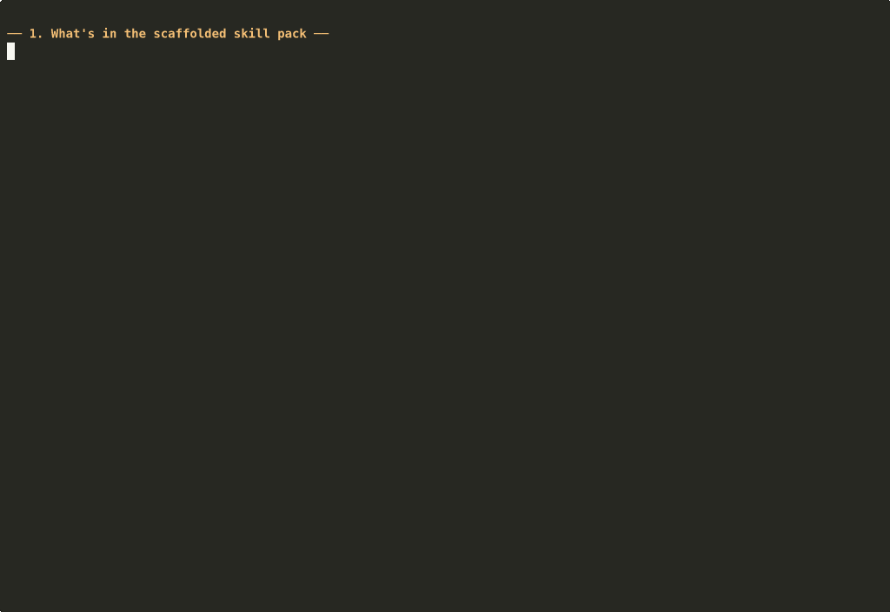

This package provides OpenClaw integration for XtraGPT.

Full documentation, examples, and paper:
https://github.com/nuojohnchen/XtraGPT

# xtragpt-paper-revision-skill

OpenClaw skill pack for using a self-hosted XtraGPT endpoint as a paper revision specialist.

## What this package does

This package installs:
- a provider config for a local or remote OpenAI-compatible XtraGPT endpoint
- a paper-revision skill definition
- routing rules that auto-invoke the skill for academic editing requests
- a minimal example OpenClaw config

This package does **not** serve the model for you. You must already have a self-hosted OpenAI-compatible XtraGPT endpoint.

## Prerequisites

Example self-hosted endpoint:

```yaml
model:
  provider: openai_compatible
  base_url: http://127.0.0.1:8088/v1
  model: Xtra-Computing/XtraGPT-7B
```

Set environment variables before running OpenClaw:

```bash
export XTRAGPT_BASE_URL=http://127.0.0.1:8088/v1
export XTRAGPT_API_KEY=dummy
```

## Install

```bash
npm install xtragpt-paper-revision-skill
npx xtragpt-paper-revision-skill init
```

This writes the following files into your current project:

```text
openclaw/
├── openclaw.config.example.yaml
├── providers/
│   └── provider.xtragpt.yaml
├── routers/
│   └── router.auto_route_rules.yaml
└── skills/
    └── skill.xtragpt-paper-revision-skill.yaml
```

To scaffold into a different directory:

```bash
npx xtragpt-paper-revision-skill init --dir /path/to/project
```

To overwrite existing files:

```bash
npx xtragpt-paper-revision-skill init --force
```

## Skill ID

Use this skill id in router rules or manual invocations:

```text
xtragpt-paper-revision-skill
```

## Included provider mapping

OpenClaw model id:

```text
xtragpt-7b
```

Served provider model name:

```text
Xtra-Computing/XtraGPT-7B
```

## Suggested usage flow

1. Start your self-hosted XtraGPT server.
2. Install and initialize this package.
3. Include the generated provider, skill, and router YAML files in your OpenClaw project.
4. Keep your GitHub repo as the main documentation hub for deployment details, examples, and paper framing.

## Live demo

End-to-end recording of this skill driving a real OpenClaw install, comparing XtraGPT-7B against its base model (Qwen2.5-7B-Instruct) and a much larger general-purpose LLM (GLM-5.1) on the same paper-revision task:



Full side-by-side output: [`tests/openclaw-demo/outputs/before_after.md`](../tests/openclaw-demo/outputs/before_after.md)

Reproduce the demo locally:

```bash
# from repo root
bash tests/openclaw-demo/start_vllm.sh          # serves XtraGPT-7B on :8088 and Qwen2.5-7B on :8089
python tests/openclaw-demo/run_demo.py          # runs the three backends with the skill's prompt template
asciinema play tests/openclaw-demo/demo.cast    # replay the recorded session
```

Input paper: e.g. [DRBO](https://aclanthology.org/2025.findings-emnlp.468.pdf). Backends receive the identical skill-rendered prompt (temperature 0.1, max_tokens 1024).

Observed on the DRBO paper's abstract + introduction:

| Backend | Latency | Output tokens | Notes |
| --- | --- | --- | --- |
| XtraGPT-7B (local) | 2.0 – 2.8 s | 149 – 225 | Concise, no meta-wrapping, keeps citations intact |
| Qwen2.5-7B base (local) | 2.0 – 3.5 s | 152 – 274 | Same capacity as XtraGPT but wraps output in `Revised text:` / `Revision notes:` boilerplate |
| GLM-5.1 (z.ai) | 10 – 24 s | 242 | Fluent but wordier; 5–12× slower |

### Integration note

The npm package scaffolds provider / skill / router YAML into `openclaw/`, but as of OpenClaw 2026.3.2 the `openclaw skills list` command resolves skills from npm plugins only, so the scaffolded YAML is not auto-ingested. The demo driver (`run_demo.py`) loads the scaffolded `skill.xtragpt-paper-revision-skill.yaml` directly to render the prompt template, which is the actual contract surface. A future release of this package should register a proper OpenClaw plugin so `openclaw skills list` picks it up.
